# 截图

1. 注册/登录用户
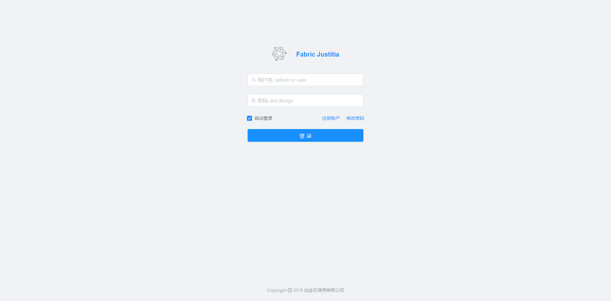

2. 初始化环境配置
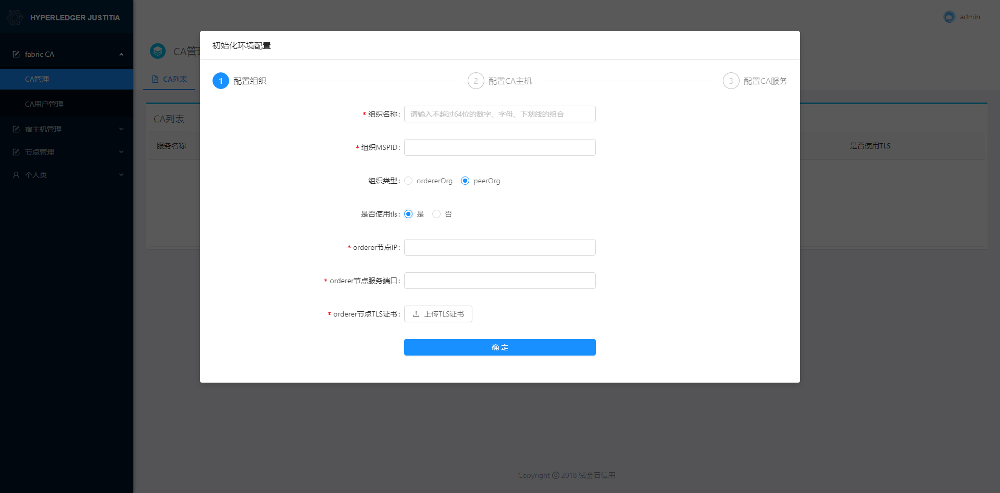
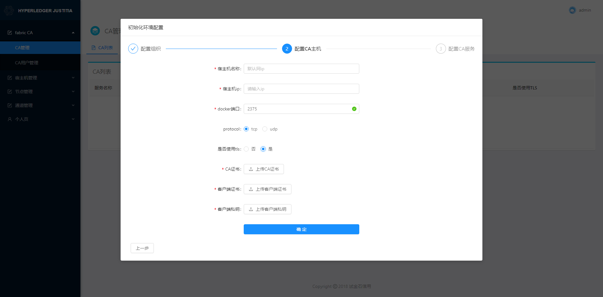
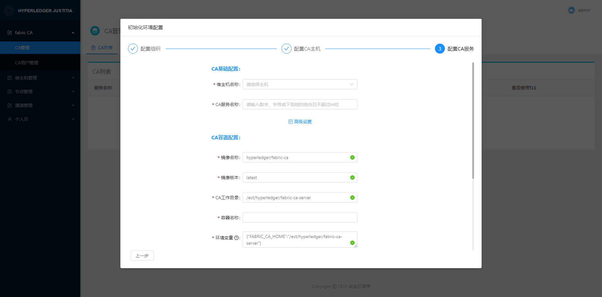

3. 证书管理借助Fabric CA完成
 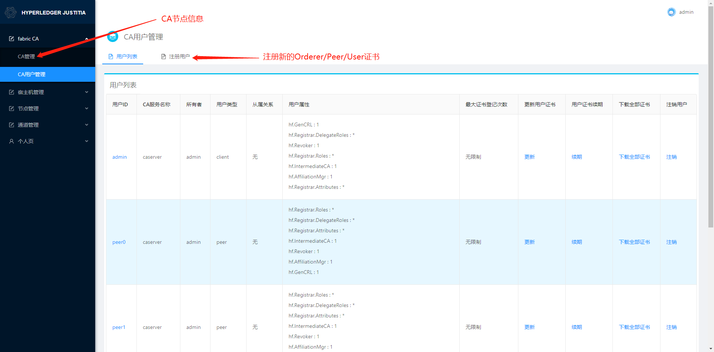

4. 宿主机管理
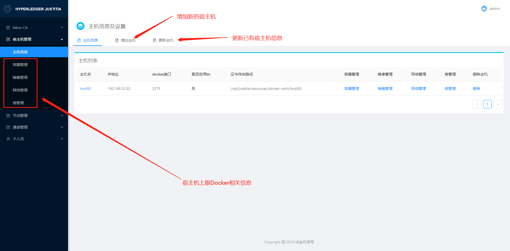

5. 节点管理  
由于本项目的设计初衷是针对于单个组织使用，作者认为Orderer节点和Peer节点分属于不同的组织，Peer组织只能部署Peer节点，Orderer组织只能部署Orderer节点。如若本人理解有误，烦请在Issue中提出，非常感谢。
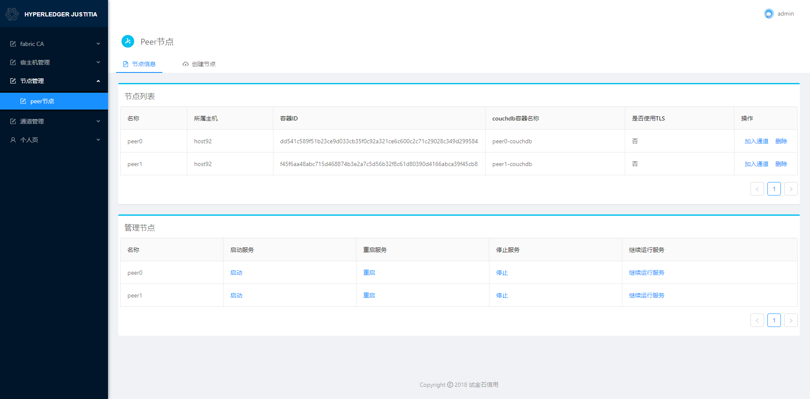
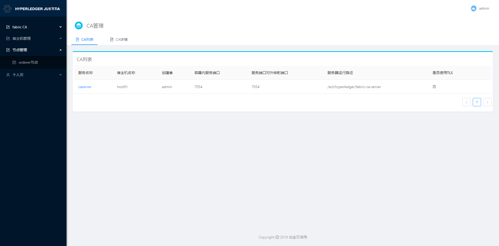

6. 通道管理  
管理通道成员需要提交一个更新通道配置的交易，这个交易需要收集通道内现有成员的管理员签名，借助于自定义的系统链码cmscc，用户可以在`任务管理`界面可视化的完成这个审批流程。
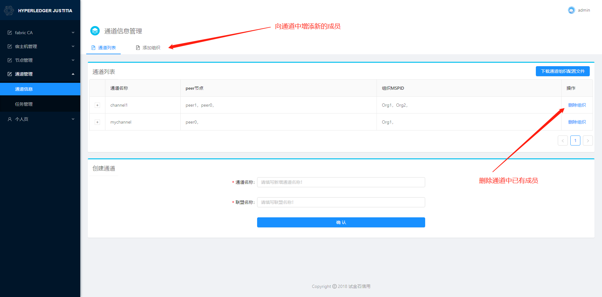
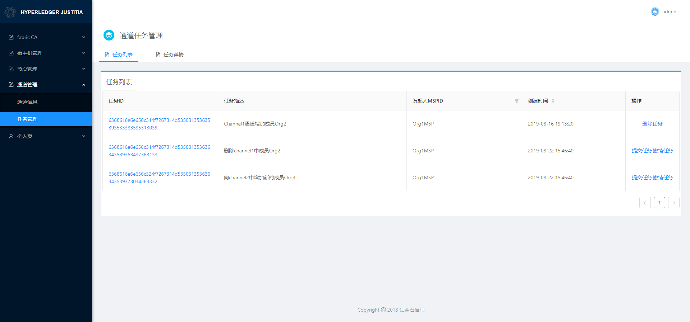

7. 联盟成员管理
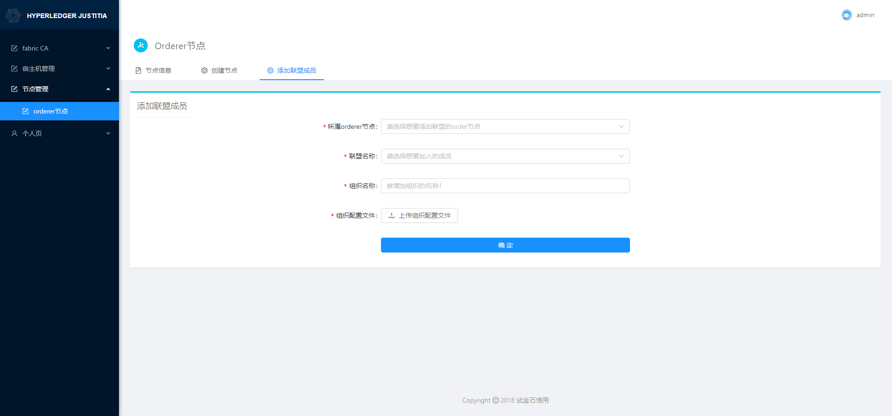